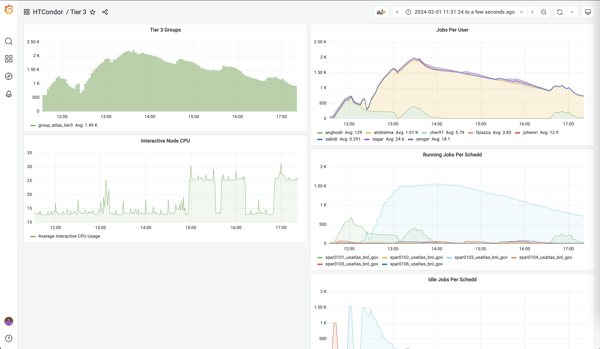

# FCC on SDCC

## Ntuple production

Quickstart:

Example ssh into BNL cluster:

```
sudo ssh -i .ssh/id_rsa atishelma@ssh.sdcc.bnl.gov # asks you for your PC password
rterm -i spar0103 # or ssh atishelma@spar0103.usatlas.bnl.gov - asks you for your bnl account password
```

Clone `FCCAnalyses`:

```
mkdir FCC_at_BNL
cd FCC_at_BNL
```

via https:

```
git clone https://github.com/BNL-FCCee/FCCAnalyses.git -b ZH_Hadronic_SelfCoupling
```

via ssh:

```
git clone git@github.com:BNL-FCCee/FCCAnalyses.git -b ZH_Hadronic_SelfCoupling
```

set up:

```
cd FCCAnalyses
source /cvmfs/sw.hsf.org/key4hep/releases/2023-06-05-fcchh/x86_64-centos7-gcc12.2.0-opt/key4hep-stack/*/setup.sh
source setup.sh
fccanalysis build
...
model_dir = "<path/to/repo>/FCCAnalyses"
```

change `outputDir` variable in `ZH_Hadronic_stage1.py` to desired output location, then process a few files:

```
fccanalysis run ZH_Hadronic_stage1.py --output wzp6_ee_ccH_Hcc_ecm240.root --files-list /eos/experiment/fcc/ee/generation/DelphesEvents/winter2023/IDEA/wzp6_ee_ccH_Hcc_ecm240/events_056080797.root --nev 10
```

check that your output file is there:

```
root -l <outputDir>/wzp6_ee_ccH_Hcc_ecm240.root
```

to submit on `HTCondor`, edit the `ZH_Hadronic_stage1.py` configuration file parameters to the desired values, for example:

```
batch = 1 # use HTCondor
EOSoutput = 0 # output to EOS
JobName = "ZHadronic_4JetReco" # job name used for output directory
njets = 4 # number of jets in exclusive reclustering
outputDir   = f"/usatlas/atlas01/atlasdisk/users/<BNLclusterUsername>/{JobName}/stage1/"
```

and in the same file, choose the samples to run over, for example just one ZH process:

```
processList = {
    "wzp6_ee_bbH_Hbb_ecm240" : {'chunks' : 2},
}
```

then run without the extra flags from before:

```
fccanalysis run ZH_Hadronic_stage1.py
```

see if your jobs were submitted:

```
condor_q
condor_q -batch
```

from a full production of many processes, you should see something like:

```
[spar0103] /usatlas/u/atishelma/FCC/FCCAnalyses > condor_q -batch

-- Schedd: spar0103.usatlas.bnl.gov : <130.199.48.19:9618?... @ 02/01/24 06:17:17
OWNER     BATCH_NAME     SUBMITTED   DONE   RUN    IDLE  TOTAL JOB_IDS
atishelma ID: 1656494   2/1  06:14      _      1      _      1 1656494.0
atishelma ID: 1656495   2/1  06:14      _      2      _      2 1656495.0-1
atishelma ID: 1656496   2/1  06:14      _      2      _      2 1656496.0-1
atishelma ID: 1656497   2/1  06:14      _      2      _      2 1656497.0-1
atishelma ID: 1656498   2/1  06:15      _      2      _      2 1656498.0-1
atishelma ID: 1656499   2/1  06:15      _      2      _      2 1656499.0-1
atishelma ID: 1656500   2/1  06:15      _      2      _      2 1656500.0-1
atishelma ID: 1656501   2/1  06:15      _      2      _      2 1656501.0-1
atishelma ID: 1656502   2/1  06:15      _      2      _      2 1656502.0-1
atishelma ID: 1656503   2/1  06:15      _      2      _      2 1656503.0-1
atishelma ID: 1656504   2/1  06:15      _      2      _      2 1656504.0-1
atishelma ID: 1656505   2/1  06:15      _      2      _      2 1656505.0-1
atishelma ID: 1656506   2/1  06:15      _      2      _      2 1656506.0-1
atishelma ID: 1656507   2/1  06:15      _      2      _      2 1656507.0-1
atishelma ID: 1656508   2/1  06:15      _      2      _      2 1656508.0-1
atishelma ID: 1656509   2/1  06:15      _      2      _      2 1656509.0-1
atishelma ID: 1656510   2/1  06:15      _      2      _      2 1656510.0-1
atishelma ID: 1656511   2/1  06:15      _      2      _      2 1656511.0-1
atishelma ID: 1656512   2/1  06:15      _      2      _      2 1656512.0-1
atishelma ID: 1656513   2/1  06:15      _      2      _      2 1656513.0-1
atishelma ID: 1656514   2/1  06:15      _      2      _      2 1656514.0-1
atishelma ID: 1656515   2/1  06:15      _      2      _      2 1656515.0-1
atishelma ID: 1656516   2/1  06:15      _      2      _      2 1656516.0-1
atishelma ID: 1656517   2/1  06:15      _      2      _      2 1656517.0-1
atishelma ID: 1656518   2/1  06:15      _      2      _      2 1656518.0-1
atishelma ID: 1656519   2/1  06:15      _      2      _      2 1656519.0-1
atishelma ID: 1656520   2/1  06:15      _      2      _      2 1656520.0-1
atishelma ID: 1656521   2/1  06:15      _      2      _      2 1656521.0-1
atishelma ID: 1656522   2/1  06:15      _      2      _      2 1656522.0-1
atishelma ID: 1656523   2/1  06:15      _      2      _      2 1656523.0-1
atishelma ID: 1656524   2/1  06:15      _      2      _      2 1656524.0-1
atishelma ID: 1656525   2/1  06:15      _      2      _      2 1656525.0-1
atishelma ID: 1656526   2/1  06:15      _      2      _      2 1656526.0-1
atishelma ID: 1656527   2/1  06:16      _    106    894   1000 1656527.0-999
atishelma ID: 1656528   2/1  06:16      _      _    250    250 1656528.0-249
atishelma ID: 1656529   2/1  06:16      _      _    250    250 1656529.0-249

Total for query: 1565 jobs; 0 completed, 0 removed, 1394 idle, 171 running, 0 held, 0 suspended 
Total for atishelma: 1565 jobs; 0 completed, 0 removed, 1394 idle, 171 running, 0 held, 0 suspended 
Total for all users: 1567 jobs; 0 completed, 0 removed, 1394 idle, 173 running, 0 held, 0 suspended
```

You can also monitor your condor jobs here:

https://monitoring.sdcc.bnl.gov/grafana/d/000000006/tier-3?orgId=1&from=now-24h&to=now



## Selections, categorization, histograms

Run [`CharmCutCode`](https://gitlab.cern.ch/sabidi/CharmCutCode/-/tree/Zcc_SelfCoupling?ref_type=heads) (to be moved to this Github organization). Quick start, after following setup instructions in repository:

Run one file, output from previous step, locally to make sure things are working:

```
cd CharmCutCode/run
runAnalysis --nEvents 1000 --inputFileList /usatlas/atlas01/atlasdisk/users/atishelma/ZHadronic_4JetReco/stage1/wzp6_ee_ccH_Hbb_ecm240/chunk_0.root --analType ZHAllHad --sampleName wzp6_ee_ccH_Hbb_ecm240 --processName Hbb --SOWJSONfile ../source/CharmCutCode/data/FCCee_procDict_winter2023_IDEA.json --outputFileName wzp6_ee_ccH_Hbb_ecm240.root
```

Run over HTCondor:

```

```

## Workspaces

Create a workspace from one file locally to make sure things are working properly:

```
makeWS --jsonConfig ../source/WSMaker/data/ZHAllHadConfig_test.json --inputFile wzp6_ee_ccH_Hbb_ecm240.root --outputDir test_ws
```

Run everything over HTCondor:

```

```

## Statistical interpretation

______________________________
______________________________
______________________________

## Extra information

Cloning and building the [`FCCAnalyses`](https://github.com/HEP-FCC/FCCAnalyses) repository on the [BNL SDCC](https://www.sdcc.bnl.gov/) ATLAS cluster should largely follow the same steps as cloning and building the repository on [`lxplus`](https://abpcomputing.web.cern.ch/computing_resources/lxplus/).

Currently, one known difference is that when building on SDCC, one must add the following line to their `CMakeLists.txt` file:

```
link_directories(/cvmfs/sw.hsf.org/spackages7/intel-tbb/2020.3/x86_64-centos7-gcc11.2.0-opt/ey3ft/lib /cvmfs/sw.hsf.org/spackages7/zlib/1.2.13/x86_64-centos7-gcc11.2.0-opt/2wmsk/lib)
```

Example ssh into BNL cluster:

```
sudo ssh -i .ssh/id_rsa atishelma@ssh.sdcc.bnl.gov
rterm -i spar0103 # or ssh atishelma@spar0103.usatlas.bnl.gov
bash
```

When cloning the master branch of `FCCAnalyses`, I found I had to source a particular key4hep stack and build like so:

```
source /cvmfs/sw.hsf.org/key4hep/releases/2023-06-05-fcchh/x86_64-centos7-gcc12.2.0-opt/key4hep-stack/*/setup.sh
source setup.sh
fccanalysis build
```

Run the ZH hadronic ntupler:

```
fccanalysis run ZH_Hadronic_stage1.py --output wzp6_ee_ccH_Hcc_ecm240.root --files-list /eos/experiment/fcc/ee/generation/DelphesEvents/winter2023/IDEA/wzp6_ee_ccH_Hcc_ecm240/events_056080797.root --nev 10
```

Lines I found useful to add in my ~/.vimrc:

```
hi Search cterm=NONE ctermfg=grey ctermbg=blue
:set number
```

Lines I found useful to add in my ~/.bashrc:

```
export KRB5CCNAME=$HOME/krb5cc_`id -u`
kinit atishelm@CERN.CH
alias 'l=ls -lrt --color=auto'
alias 'gst=git status'
stty erase '^?' # fix vim backspace issue
alias grep='grep --color=auto'
```

Stat analysis related commands after producing ntuples:

In CharmCutCode repo, to process one file:

```
runAnalysis --nEvents 1000 --inputFileList /eos/user/a/atishelm/ntuples/FCC/ZH_Hadronic_4JetReco/wzp6_ee_ccH_Hbb_ecm240/chunk0.root --analType SelfCoupling --sampleName wzp6_ee_ccH_Hbb_ecm240 --processName Hbb
```

Run over everything with condor:

```

```
